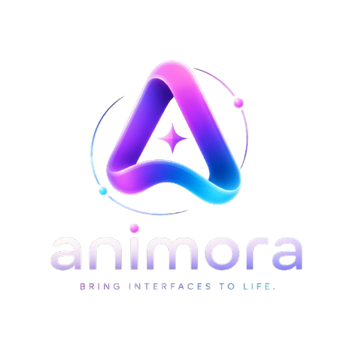

<p align="center">
  
</p>

<h1 align="center">Animora</h1>
<p align="center">Bring interfaces to life ✨</p>

A JavaScript/React framework of 100+ living characters and an emotion engine that makes your UI expressive, interactive and alive.

[Features](#features) • [Installation](#installation) • [Quick Start](#quick-start) • [Documentation](#documentation) • [Characters](#characters) • [Emotion Engine](#emotion-engine)

</div>

---
## 📸 Demo

## Features

- 🎭 **100+ Living Characters** - A diverse cast of expressive characters including fox, robot, ghost, boy, and panda variants
- 💭 **Emotion Engine** - Dynamic emotion system with 10 distinct emotional states (happy, excited, thinking, sad, angry, love, neutral, confused, scared, surprised)
- ✨ **Motion Design System** - Spring physics-based animations with smooth transitions
- 🎨 **Complete Design System** - Pre-built tokens for colors, typography, spacing, shadows, and motion
- ⚡ **Lightweight & Fast** - Optimized for performance with tree-shaking support
- 🎯 **Developer Friendly** - Full TypeScript support with comprehensive type definitions
- 🚀 **React & Framer Motion** - Built on React 18 and Framer Motion for advanced animations
- 🎪 **Interactive Components** - Ready-to-use components like AnimatedButton with character integration

## Installation

```bash
npm install animora
# or
yarn add animora
# or
pnpm add animora
```

## Quick Start

### Basic Character

```jsx
import { Character } from 'animora';

function App() {
  return (
    <Character
      type="fox"
      size="lg"
      emotion="happy"
      interactive={true}
    />
  );
}
```

### With Emotion Engine

```jsx
import { Character, EmotionEngine } from 'animora';
import { useEffect, useRef } from 'react';

function ExpressiveCharacter() {
  const engineRef = useRef(new EmotionEngine('neutral'));

  const setEmotion = (emotion) => {
    engineRef.current.setEmotion(emotion, 1, 300);
  };

  return (
    <div>
      <Character
        type="robot"
        size="lg"
        emotion={engineRef.current.getState().current}
        variant="glowing"
      />
      <button onClick={() => setEmotion('excited')}>Make it excited!</button>
    </div>
  );
}
```

### Interactive Button

```jsx
import { AnimatedButton } from 'animora';

function MyButton() {
  return (
    <AnimatedButton
      variant="primary"
      size="md"
      character="fox"
      emotion="happy"
      onClick={() => console.log('Clicked!')}
    >
      Click Me
    </AnimatedButton>
  );
}
```

## Documentation

### Characters

Available character types:

- **fox** - Playful and clever fox character with ear twitching
- **robot** - Futuristic interactive robot with LED eyes
- **ghost** - Friendly ghost character
- **boy** - Expressive boy character 
- **panda** - Cute and calm panda character 

### Character Props

```typescript
interface CharacterProps {
  type: 'fox' | 'robot' | 'ghost' | 'boy' | 'panda';
  size?: 'xs' | 'sm' | 'md' | 'lg' | 'xl';
  emotion?: Emotion;
  variant?: 'default' | 'outline' | 'glowing' | 'interactive';
  interactive?: boolean;
  animated?: boolean;
  onClick?: () => void;
  onHover?: (hovering: boolean) => void;
  className?: string;
  style?: React.CSSProperties;
}
```

### Emotion Engine

The Emotion Engine manages character expressions and reactions.

```typescript
import { EmotionEngine, type Emotion } from 'animora';

const engine = new EmotionEngine('neutral');

// Set emotion with intensity and duration
engine.setEmotion('happy', 0.8, 300);

// Get animation configuration
const animation = engine.getEmotionAnimation('excited', 1);

// React to interaction
engine.react(1.2);

// Return to neutral
engine.reset(300);

// Listen for changes
engine.on('emotionChanged', (data) => {
  console.log('Emotion changed to:', data.emotion);
});
```

### Emotions

- **happy** 😊 - Bright, uplifting yellow glow
- **excited** 🤩 - Intense cyan energy
- **thinking** 🤔 - Calm blue contemplation
- **sad** 😢 - Soft purple melancholy
- **angry** 😠 - Red coral intensity
- **love** 💕 - Pink warmth
- **neutral** 😐 - No glow
- **confused** 🤨 - Amber uncertainty
- **scared** 😨 - Red alarm
- **surprised** 😲 - Cyan shock

## Design System

### Colors

```typescript
import { COLORS } from 'animora';

// Gradient
COLORS.gradient.primary // "linear-gradient(90deg, #FF1493 0%, #8B5CF6 50%, #00D9FF 100%)"

// Brand Colors
COLORS.brand.purple // "#8B5CF6"
COLORS.brand.pink   // "#FF1493"
COLORS.brand.blue   // "#3B82F6"
COLORS.brand.cyan   // "#00D9FF"

// Emotion Glows
COLORS.emotions.happy    // "#FFB800"
COLORS.emotions.excited  // "#00D9FF"
COLORS.emotions.thinking // "#3B82F6"
// ... and more
```

### Typography

```typescript
import { TYPOGRAPHY } from 'animora';

// Fonts
TYPOGRAPHY.display.fontFamily // 'Satoshi'
TYPOGRAPHY.body.fontFamily    // 'Inter'
TYPOGRAPHY.code.fontFamily    // 'Fira Code'

// Preset styles
TYPOGRAPHY.presets.h1    // Large headings
TYPOGRAPHY.presets.body  // Body text
TYPOGRAPHY.presets.code  // Code blocks
```

### Motion

```typescript
import { MOTION } from 'animora';

// Spring presets
MOTION.spring.light   // Smooth, subtle
MOTION.spring.normal  // Balanced
MOTION.spring.medium  // More bouncy
MOTION.spring.stiff   // Quick, responsive

// Transitions
MOTION.transitions.hover         // Hover animations
MOTION.transitions.click         // Click feedback
MOTION.transitions.emotionChange // Emotion transitions
```

## API Reference

### Character

```jsx
<Character
  type="fox"               // Character type
  size="md"               // Character size (xs, sm, md, lg, xl,2xl)
  emotion="happy"         // Current emotion
  variant="glowing"       // Visual variant
  interactive={true}      // Enable interactions
  animated={true}         // Enable animations
  onClick={() => {}}      // Click handler
  onHover={(hovering) => {}} // Hover handler
/>
```

### AnimatedButton

```jsx
<AnimatedButton
  variant="primary"       // 'primary' | 'secondary' | 'outline'
  size="md"              // 'sm' | 'md' | 'lg'
  character="fox"        // Character to display
  characterSize="sm"     // Character size
  emotion="happy"        // Character emotion
  disabled={false}       // Disabled state
  loading={false}        // Loading state
  onClick={() => {}}     // Click handler
>
  Button Text
</AnimatedButton>
```

## Examples

### Gallery

```jsx
import { Character, CHARACTERS } from 'animora';

function CharacterGallery() {
  const characters = ['fox', 'robot'];

  return (
    <div style={{ display: 'grid', gridTemplateColumns: 'repeat(auto-fit, minmax(200px, 1fr))', gap: '20px' }}>
      {characters.map((char) => (
        <Character key={char} type={char} size="lg" emotion="happy" />
      ))}
    </div>
  );
}
```

### Emotion Showcase

```jsx
import { Character } from 'animora';
import { useState } from 'react';

function EmotionShowcase() {
  const emotions = ['happy', 'excited', 'thinking', 'sad', 'angry'];
  const [current, setCurrent] = useState(0);

  return (
    <div>
      <Character type="fox" size="xl" emotion={emotions[current]} />
      <div style={{ display: 'flex', gap: '10px' }}>
        {emotions.map((e, i) => (
          <button key={e} onClick={() => setCurrent(i)}>
            {e}
          </button>
        ))}
      </div>
    </div>
  );
}
```

## Brand Identity

### Primary Gradient
- Start: `#FF1493` (Pink)
- Mid: `#8B5CF6` (Purple)
- End: `#00D9FF` (Cyan)

### Brand Personality
- Creative & Playful
- Modern & Futuristic
- Smart & Emotional
- Developer Friendly
- Lightweight & Fast

### Tagline
"Bring interfaces to life."

## Browser Support

- Chrome/Edge 90+
- Firefox 88+
- Safari 14+
- Mobile browsers (iOS Safari, Chrome Mobile)

## Performance

- Optimized SVG rendering
- Efficient animation frame management
- Tree-shaking support
- ~150KB gzipped (with all dependencies)

## ⚡ Roadmap
 Fox character
 Emotion engine
 Eye tracking
 100+ characters
 Emotion blending system
 WebGL characters
 AI-driven reactions

## Contributing

We welcome contributions! Please see our [Contributing Guide](CONTRIBUTING.md) for details.

## License

MIT © 2024 Animora Team

## Resources

- 📖 [Full Documentation](https://animora.dev/docs)
- 🎨 [Design System](https://animora.dev/design)
- 🎭 [Character Gallery](https://animora.dev/characters)
- 💬 [Discord Community](https://discord.gg/animora)
- 🐛 [Issue Tracker](https://github.com/animora-dev/animora/issues)

---

<div align="center">

Made with ❤️ by Ghada Chouichi

[Live Demo](https://animora.dev) • [GitHub](https://github.com/animora-dev/animora) • [NPM](https://npmjs.com/package/animora)

</div>
